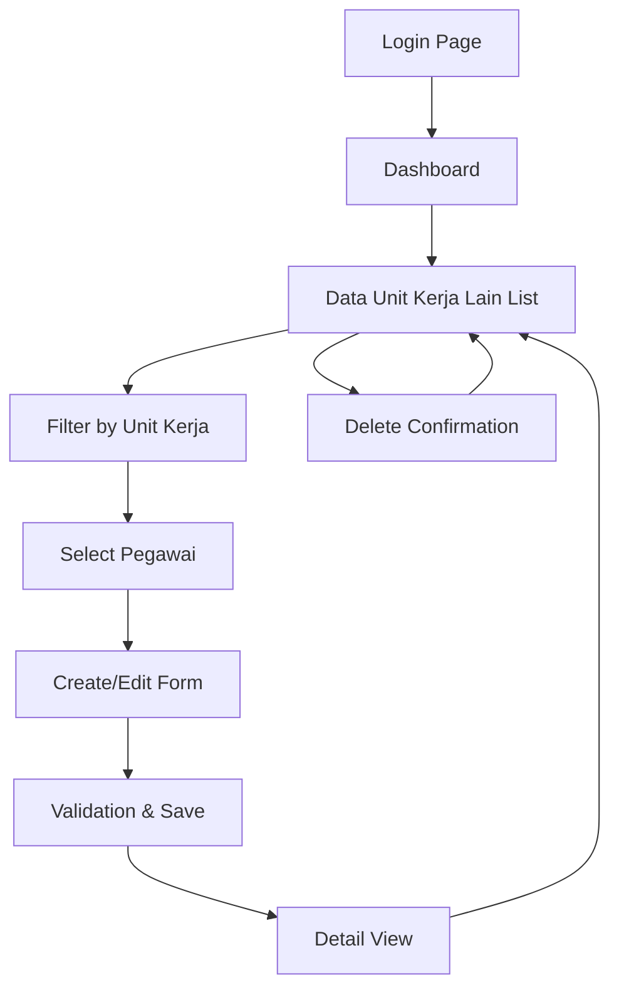

# Product Requirements Document (PRD) - Data Unit Kerja Lain

## 1. Product Overview

Sistem manajemen data riwayat unit kerja lain untuk mencatat dan mengelola informasi pegawai yang pernah atau sedang bekerja di organisasi/instansi lain di luar unit kerja utama mereka.

- Memungkinkan admin HR untuk mencatat, memantau, dan mengelola riwayat pekerjaan pegawai di tempat lain dengan sistem yang terintegrasi dan mudah digunakan.
- Target: Meningkatkan transparansi dan akurasi data kepegawaian serta mendukung pengambilan keputusan strategis terkait manajemen SDM.

## 2. Core Features

### 2.1 User Roles

| Role | Registration Method | Core Permissions |
|------|---------------------|------------------|
| Super Admin | System assignment | Full access to all data unit kerja lain operations |
| Admin HR | Admin invitation | Can create, read, update, delete data unit kerja lain |
| Staff HR | Admin assignment | Can read and update existing data unit kerja lain |
| Viewer | Role assignment | Can only view data unit kerja lain (read-only) |

### 2.2 Feature Module

Sistem Data Unit Kerja Lain terdiri dari halaman-halaman utama berikut:
1. **Halaman Daftar Data Unit Kerja Lain**: tabel data, filter dinamis, pencarian, aksi CRUD.
2. **Halaman Form Tambah/Edit**: formulir input data, validasi real-time, upload dokumen.
3. **Halaman Detail**: tampilan lengkap informasi, riwayat perubahan, dokumen terkait.

### 2.3 Page Details

| Page Name | Module Name | Feature description |
|-----------|-------------|---------------------|
| Halaman Daftar | Tabel Data | Display semua data unit kerja lain dengan pagination, sorting, dan filtering berdasarkan unit kerja dan pegawai |
| Halaman Daftar | Filter Dinamis | Filter real-time berdasarkan unit kerja yang otomatis memperbarui daftar pegawai |
| Halaman Daftar | Pencarian | Search functionality untuk nama, jabatan, dan status pekerjaan |
| Halaman Daftar | Aksi CRUD | Create, read, update, delete operations dengan konfirmasi dan validasi |
| Form Tambah/Edit | Input Validation | Validasi komprehensif untuk semua field dengan pesan error yang jelas |
| Form Tambah/Edit | Data Relationships | Dropdown selection untuk pegawai berdasarkan unit kerja yang dipilih |
| Form Tambah/Edit | Status Management | Enum selection untuk status bekerja dan jenis kepegawaian |
| Halaman Detail | Information Display | Tampilan lengkap semua informasi unit kerja lain pegawai |
| Halaman Detail | Audit Trail | Riwayat perubahan data dengan timestamp dan user information |

## 3. Core Process

**Admin HR Flow:**
1. Admin HR login ke sistem Filament
2. Navigasi ke menu "Data Unit Kerja Lain"
3. Pilih unit kerja dari filter untuk melihat daftar pegawai
4. Pilih pegawai spesifik dari dropdown yang sudah difilter
5. Tambah data unit kerja lain baru atau edit data existing
6. Input informasi: status bekerja di tempat lain, jenis kepegawaian, nama instansi, jabatan, fungsi
7. Set urutan prioritas data
8. Simpan data dengan validasi otomatis
9. Review dan konfirmasi perubahan

**Staff HR Flow:**
1. Staff HR login dengan permission terbatas
2. Akses menu "Data Unit Kerja Lain" (read/update only)
3. Filter dan cari data yang perlu diupdate
4. Edit informasi yang diizinkan
5. Simpan perubahan dengan approval workflow

## 4. User Interface Design

### 4.1 Design Style

- **Primary Colors**: #3B82F6 (blue-500) untuk aksi utama, #10B981 (emerald-500) untuk status aktif
- **Secondary Colors**: #6B7280 (gray-500) untuk teks sekunder, #EF4444 (red-500) untuk peringatan
- **Button Style**: Rounded corners (rounded-md), solid background dengan hover effects
- **Font**: Inter atau system font stack, ukuran 14px untuk body text, 16px untuk headings
- **Layout Style**: Card-based layout dengan shadow, top navigation dengan breadcrumbs
- **Icons**: Heroicons dengan style outline untuk konsistensi dengan Filament

### 4.2 Page Design Overview

| Page Name | Module Name | UI Elements |
|-----------|-------------|-------------|
| Halaman Daftar | Header Section | Page title "Data Unit Kerja Lain", breadcrumb navigation, create button (primary blue) |
| Halaman Daftar | Filter Section | Unit kerja dropdown (live search), pegawai dropdown (conditional), status filters dengan badge colors |
| Halaman Daftar | Data Table | Striped rows, sortable columns, action buttons (edit: blue, delete: red), pagination controls |
| Form Tambah/Edit | Form Layout | Two-column responsive layout, grouped fields dengan section headers, validation messages (red text) |
| Form Tambah/Edit | Input Fields | Styled select dropdowns, text inputs dengan focus states, enum selections dengan radio buttons |
| Form Tambah/Edit | Action Buttons | Save (primary blue), Cancel (secondary gray), positioned bottom-right |
| Halaman Detail | Information Cards | White background cards dengan subtle borders, organized information sections |
| Halaman Detail | Status Indicators | Color-coded badges untuk status (green: Ya, gray: Tidak), clear typography hierarchy |

### 4.3 Responsiveness

Desktop-first design dengan mobile-adaptive breakpoints. Tabel akan menggunakan horizontal scroll pada mobile devices. Touch interaction optimization untuk dropdown selections dan button interactions pada tablet dan mobile.

## 5. Technical Requirements

### 5.1 Database Schema

**Table: data_riwayat_unit_kerja_lain**
- Primary key: `id` (bigint, auto-increment)
- Foreign key: `nik_data_pegawai` (varchar 50, references data_pegawai.nik)
- Enum fields: `is_bekerja_di_tempat_lain` (Ya/Tidak), `status` (Tetap/Tidak Tetap/ASN)
- Data fields: `nama` (varchar 100), `jabatan` (varchar 50), `fungsi` (varchar 5)
- Metadata: `urut` (integer), `created_at`, `updated_at` (timestamps)

### 5.2 Model Relationships

- **BelongsTo**: DataPegawai (via nik_data_pegawai)
- **HasOneThrough**: UnitKerja (via DataPegawai relationship)
- **Scopes**: ActiveEmployees, ByUnitKerja, ByStatus

### 5.3 Validation Rules

- `nik_data_pegawai`: required, exists in data_pegawai table
- `is_bekerja_di_tempat_lain`: nullable, enum validation
- `status`: nullable, enum validation (Tetap/Tidak Tetap/ASN)
- `nama`: nullable, max 100 characters, string validation
- `jabatan`: nullable, max 50 characters, string validation
- `fungsi`: nullable, max 5 characters, string validation
- `urut`: required, integer, min 1

### 5.4 API Endpoints

- `GET /admin/data-riwayat-unit-kerja-lain` - List with filtering
- `POST /admin/data-riwayat-unit-kerja-lain` - Create new record
- `GET /admin/data-riwayat-unit-kerja-lain/{id}` - Show specific record
- `PUT /admin/data-riwayat-unit-kerja-lain/{id}` - Update record
- `DELETE /admin/data-riwayat-unit-kerja-lain/{id}` - Delete record

## 6. Role-Based Access Control

### 6.1 Permission Structure

**Resource Permissions:**
- `view_data::riwayat::unit::kerja::lain` - View data unit kerja lain
- `view_any_data::riwayat::unit::kerja::lain` - View all data unit kerja lain
- `create_data::riwayat::unit::kerja::lain` - Create new data unit kerja lain
- `update_data::riwayat::unit::kerja::lain` - Update existing data unit kerja lain
- `delete_data::riwayat::unit::kerja::lain` - Delete data unit kerja lain
- `delete_any_data::riwayat::unit::kerja::lain` - Bulk delete data unit kerja lain

### 6.2 Role Assignments

**RolePermissionSeederRiwayatUnitKerja** akan membuat:
- Super Admin: All permissions
- Admin HR: All permissions except delete_any
- Staff HR: view, view_any, update permissions only
- Viewer: view, view_any permissions only

## 7. Testing Strategy

### 7.1 Unit Testing

- **Model Tests**: Relationship testing, validation rules, scopes functionality
- **Policy Tests**: Permission checking for each user role
- **Factory Tests**: Data generation and seeding functionality
- **Migration Tests**: Database schema creation and constraints

### 7.2 Feature Testing

- **CRUD Operations**: Complete create, read, update, delete workflows
- **Filter Testing**: Unit kerja and pegawai dynamic filtering
- **Validation Testing**: Form validation rules and error handling
- **Permission Testing**: Role-based access control verification

### 7.3 Integration Testing

- **Filament Resource**: Form rendering, table display, action functionality
- **Database Integration**: Foreign key constraints, data integrity
- **Menu Integration**: Navigation and breadcrumb functionality
- **API Testing**: Endpoint responses and data consistency

## 8. Performance Requirements

- **Page Load Time**: < 2 seconds for data table with 1000+ records
- **Filter Response**: < 500ms for dynamic pegawai filtering
- **Database Queries**: Optimized with proper indexing and eager loading
- **Memory Usage**: Efficient pagination to handle large datasets

## 9. Security Considerations

- **Input Sanitization**: All user inputs properly validated and sanitized
- **SQL Injection Prevention**: Eloquent ORM usage with parameter binding
- **Access Control**: Strict role-based permissions enforcement
- **Audit Trail**: Logging of all data modifications with user tracking

## 10. Deployment Requirements

- **Migration Safety**: Non-destructive migrations that only affect new table
- **Seeder Isolation**: RolePermissionSeederRiwayatUnitKerja runs independently
- **Rollback Plan**: Ability to rollback migrations without affecting existing data
- **Environment Compatibility**: Works across development, staging, and production environments