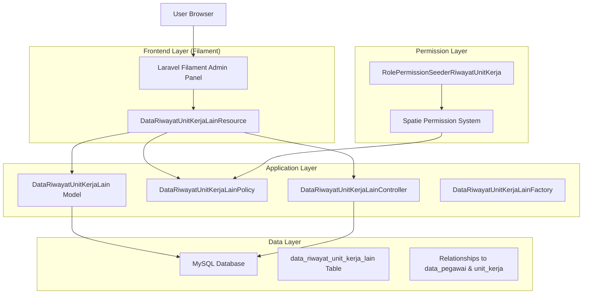
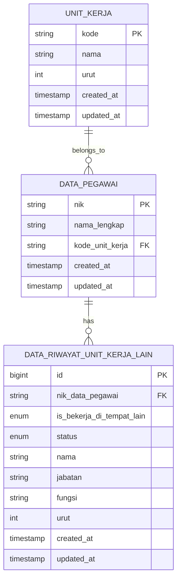

# Technical Architecture Document - Data Unit Kerja Lain

## 1. Architecture Design



## 2. Technology Description

- **Frontend**: Laravel Filament v3 + Livewire + Alpine.js + Tailwind CSS
- **Backend**: Laravel v10 + Eloquent ORM
- **Database**: MySQL 8.0
- **Authentication**: Laravel Sanctum + Spatie Laravel Permission
- **Testing**: PHPUnit + Pest (optional)

## 3. Route Definitions

| Route | Purpose |
|-------|---------|
| /admin/data-riwayat-unit-kerja-lains | Main resource index page with data table and filters |
| /admin/data-riwayat-unit-kerja-lains/create | Create new data unit kerja lain record |
| /admin/data-riwayat-unit-kerja-lains/{id} | View specific data unit kerja lain record |
| /admin/data-riwayat-unit-kerja-lains/{id}/edit | Edit existing data unit kerja lain record |

## 4. API Definitions

### 4.1 Core API

**Data Unit Kerja Lain CRUD Operations**

```
GET /admin/data-riwayat-unit-kerja-lains
```

Response:
| Param Name | Param Type | Description |
|------------|------------|-------------|
| data | array | Array of data unit kerja lain records |
| pagination | object | Pagination metadata |
| filters | object | Applied filter states |

```
POST /admin/data-riwayat-unit-kerja-lains
```

Request:
| Param Name | Param Type | isRequired | Description |
|------------|------------|------------|-------------|
| nik_data_pegawai | string | true | Employee NIK reference |
| is_bekerja_di_tempat_lain | enum | false | Working at other place (Ya/Tidak) |
| status | enum | false | Employment status (Tetap/Tidak Tetap/ASN) |
| nama | string | false | Organization/company name |
| jabatan | string | false | Position/job title |
| fungsi | string | false | Function code |
| urut | integer | true | Sort order |

```
PUT /admin/data-riwayat-unit-kerja-lains/{id}
```

Request: Same as POST with record ID in URL

```
DELETE /admin/data-riwayat-unit-kerja-lains/{id}
```

Response:
| Param Name | Param Type | Description |
|------------|------------|-------------|
| success | boolean | Deletion status |
| message | string | Success/error message |

Example Request:
```json
{
  "nik_data_pegawai": "123456789",
  "is_bekerja_di_tempat_lain": "Ya",
  "status": "Tetap",
  "nama": "PT. Contoh Perusahaan",
  "jabatan": "Manager",
  "fungsi": "MNG01",
  "urut": 1
}
```

## 5. Server Architecture Diagram

```mermaid
graph TD
  A[Filament Admin Panel] --> B[Resource Controller Layer]
  B --> C[Policy Authorization Layer]
  C --> D[Service Layer]
  D --> E[Model Layer (Eloquent)]
  E --> F[(MySQL Database)]

  subgraph "Filament Resource Stack"
    G[DataRiwayatUnitKerjaLainResource]
    H[Form Components]
    I[Table Components]
    J[Filter Components]
  end

  subgraph "Laravel Application Stack"
    B
    C
    D
    E
    K[Validation Layer]
    L[Factory & Seeder]
  end

  A --> G
  G --> H
  G --> I
  G --> J
```

## 6. Data Model

### 6.1 Data Model Definition



### 6.2 Data Definition Language

**Data Riwayat Unit Kerja Lain Table (data_riwayat_unit_kerja_lain)**

```sql
-- Create table
CREATE TABLE data_riwayat_unit_kerja_lain (
    id BIGINT(20) UNSIGNED NOT NULL AUTO_INCREMENT,
    nik_data_pegawai VARCHAR(50) NOT NULL,
    is_bekerja_di_tempat_lain ENUM('Ya','Tidak') NULL,
    status ENUM('Tetap','Tidak Tetap','ASN') NULL,
    nama VARCHAR(100) NULL,
    jabatan VARCHAR(50) NULL,
    fungsi VARCHAR(5) NULL,
    urut INT(11) NOT NULL,
    created_at TIMESTAMP NULL DEFAULT NULL,
    updated_at TIMESTAMP NULL DEFAULT NULL,
    PRIMARY KEY (id),
    INDEX idx_nik_data_pegawai (nik_data_pegawai),
    INDEX idx_status (status),
    INDEX idx_urut (urut),
    CONSTRAINT fk_data_riwayat_unit_kerja_lain_pegawai 
        FOREIGN KEY (nik_data_pegawai) 
        REFERENCES data_pegawai(nik) 
        ON DELETE CASCADE ON UPDATE CASCADE
);

-- Create indexes for performance
CREATE INDEX idx_data_riwayat_unit_kerja_lain_nik ON data_riwayat_unit_kerja_lain(nik_data_pegawai);
CREATE INDEX idx_data_riwayat_unit_kerja_lain_status ON data_riwayat_unit_kerja_lain(status);
CREATE INDEX idx_data_riwayat_unit_kerja_lain_urut ON data_riwayat_unit_kerja_lain(urut);
CREATE INDEX idx_data_riwayat_unit_kerja_lain_created_at ON data_riwayat_unit_kerja_lain(created_at DESC);

-- Sample data insertion
INSERT INTO data_riwayat_unit_kerja_lain (
    nik_data_pegawai, 
    is_bekerja_di_tempat_lain, 
    status, 
    nama, 
    jabatan, 
    fungsi, 
    urut
) VALUES 
('123456789', 'Ya', 'Tetap', 'PT. Contoh Perusahaan', 'Manager', 'MNG01', 1),
('987654321', 'Tidak', 'ASN', 'Dinas Pendidikan', 'Staff', 'STF01', 2);
```

## 7. Model Relationships & Eloquent Implementation

### 7.1 DataRiwayatUnitKerjaLain Model

```php
// Key relationships
public function pegawai(): BelongsTo
{
    return $this->belongsTo(DataPegawai::class, 'nik_data_pegawai', 'nik');
}

// Accessor for unit kerja through pegawai
public function getUnitKerjaAttribute()
{
    return $this->pegawai?->unitKerja;
}

// Scopes for filtering
public function scopeByUnitKerja($query, $kodeUnitKerja)
{
    return $query->whereHas('pegawai', function ($q) use ($kodeUnitKerja) {
        $q->where('kode_unit_kerja', $kodeUnitKerja);
    });
}

public function scopeByStatus($query, $status)
{
    return $query->where('status', $status);
}
```

### 7.2 Validation Rules

```php
// Form validation rules
public static function getValidationRules(): array
{
    return [
        'nik_data_pegawai' => ['required', 'string', 'max:50', 'exists:data_pegawai,nik'],
        'is_bekerja_di_tempat_lain' => ['nullable', 'in:Ya,Tidak'],
        'status' => ['nullable', 'in:Tetap,Tidak Tetap,ASN'],
        'nama' => ['nullable', 'string', 'max:100'],
        'jabatan' => ['nullable', 'string', 'max:50'],
        'fungsi' => ['nullable', 'string', 'max:5'],
        'urut' => ['required', 'integer', 'min:1'],
    ];
}
```

## 8. Filament Resource Implementation

### 8.1 Form Components

```php
// Key form fields configuration
Forms\Components\Select::make('nik_data_pegawai')
    ->relationship('pegawai', 'nama_lengkap')
    ->searchable()
    ->preload()
    ->required(),

Forms\Components\Select::make('is_bekerja_di_tempat_lain')
    ->options([
        'Ya' => 'Ya',
        'Tidak' => 'Tidak',
    ])
    ->nullable(),

Forms\Components\Select::make('status')
    ->options([
        'Tetap' => 'Tetap',
        'Tidak Tetap' => 'Tidak Tetap',
        'ASN' => 'ASN',
    ])
    ->nullable(),
```

### 8.2 Table Configuration

```php
// Table columns and filters
Tables\Columns\TextColumn::make('pegawai.nama_lengkap')
    ->label('Nama Pegawai')
    ->searchable()
    ->sortable(),

Tables\Columns\BadgeColumn::make('is_bekerja_di_tempat_lain')
    ->colors([
        'success' => 'Ya',
        'secondary' => 'Tidak',
    ]),

Tables\Columns\BadgeColumn::make('status')
    ->colors([
        'success' => 'Tetap',
        'warning' => 'Tidak Tetap',
        'primary' => 'ASN',
    ]),
```

### 8.3 Dynamic Filters Implementation

```php
// Unit Kerja and Pegawai dynamic filtering
Filter::make('unit_kerja_pegawai')
    ->form([
        Forms\Components\Select::make('unit_kerja')
            ->label('Unit Kerja')
            ->options(UnitKerja::orderBy('urut')->pluck('nama', 'kode'))
            ->live()
            ->afterStateUpdated(fn (Set $set) => $set('data_pegawai', null)),
        
        Forms\Components\Select::make('data_pegawai')
            ->label('Data Pegawai')
            ->options(function (Get $get) {
                $unitKerja = $get('unit_kerja');
                if (!$unitKerja) return [];
                
                return DataPegawai::where('kode_unit_kerja', $unitKerja)
                    ->pluck('nama_lengkap', 'nik')
                    ->mapWithKeys(fn ($nama, $nik) => [$nik => "{$nama} ({$nik})"]);
            })
            ->searchable()
            ->preload(),
    ])
    ->query(function (Builder $query, array $data): Builder {
        return $query
            ->when($data['unit_kerja'], fn ($q) => $q->byUnitKerja($data['unit_kerja']))
            ->when($data['data_pegawai'], fn ($q) => $q->where('nik_data_pegawai', $data['data_pegawai']));
    }),
```

## 9. Permission System Architecture

### 9.1 Permission Structure

```php
// RolePermissionSeederRiwayatUnitKerja implementation
$permissions = [
    'view_data::riwayat::unit::kerja::lain',
    'view_any_data::riwayat::unit::kerja::lain',
    'create_data::riwayat::unit::kerja::lain',
    'update_data::riwayat::unit::kerja::lain',
    'delete_data::riwayat::unit::kerja::lain',
    'delete_any_data::riwayat::unit::kerja::lain',
];

// Role assignments
$roles = [
    'super_admin' => $permissions,
    'admin_hr' => array_diff($permissions, ['delete_any_data::riwayat::unit::kerja::lain']),
    'staff_hr' => ['view_data::riwayat::unit::kerja::lain', 'view_any_data::riwayat::unit::kerja::lain', 'update_data::riwayat::unit::kerja::lain'],
    'viewer' => ['view_data::riwayat::unit::kerja::lain', 'view_any_data::riwayat::unit::kerja::lain'],
];
```

### 9.2 Policy Implementation

```php
// DataRiwayatUnitKerjaLainPolicy key methods
public function viewAny(User $user): bool
{
    return $user->can('view_any_data::riwayat::unit::kerja::lain');
}

public function create(User $user): bool
{
    return $user->can('create_data::riwayat::unit::kerja::lain');
}

public function update(User $user, DataRiwayatUnitKerjaLain $record): bool
{
    return $user->can('update_data::riwayat::unit::kerja::lain');
}
```

## 10. Testing Architecture

### 10.1 Test Structure

```php
// Unit Tests
- DataRiwayatUnitKerjaLainTest (model relationships, scopes)
- DataRiwayatUnitKerjaLainFactoryTest (data generation)
- DataRiwayatUnitKerjaLainPolicyTest (permission checking)

// Feature Tests  
- DataRiwayatUnitKerjaLainResourceTest (CRUD operations)
- DataRiwayatUnitKerjaLainFilterTest (dynamic filtering)
- DataRiwayatUnitKerjaLainValidationTest (form validation)

// Integration Tests
- DataRiwayatUnitKerjaLainIntegrationTest (full workflow)
```

### 10.2 Performance Optimization

- **Database Indexing**: Strategic indexes on foreign keys and frequently queried columns
- **Eager Loading**: Prevent N+1 queries with proper relationship loading
- **Query Optimization**: Efficient filtering and pagination
- **Caching Strategy**: Cache unit kerja options and frequently accessed data

## 11. Deployment Considerations

### 11.1 Migration Strategy

```php
// Safe migration approach
- Create new table without affecting existing data
- Add proper foreign key constraints with cascade options
- Include rollback methods for safe deployment
- Test migration in staging environment first
```

### 11.2 Seeder Isolation

```php
// Independent seeder execution
php artisan db:seed --class=RolePermissionSeederRiwayatUnitKerja

// Verification commands
php artisan permission:show
php artisan route:list --name=data-riwayat-unit-kerja-lain
```