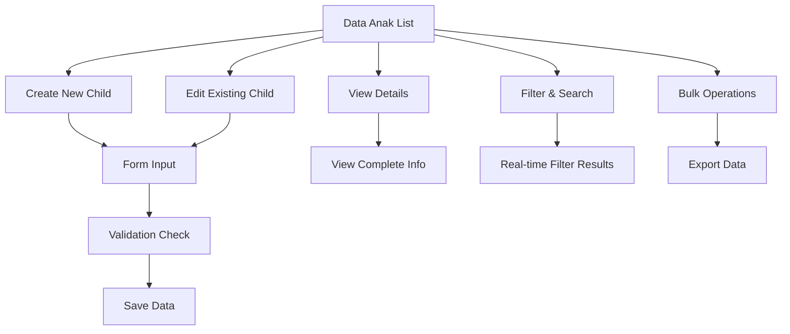

# Product Requirements Document - Data Anak Module

## 1. Product Overview
Modul Data Anak adalah sistem manajemen data anak pegawai yang memungkinkan pengelolaan informasi lengkap anak-anak pegawai termasuk data pribadi, pendidikan, dan pekerjaan.
- Modul ini mengelola data anak pegawai untuk keperluan tunjangan keluarga, asuransi kesehatan, dan administrasi kepegawaian lainnya.
- Target pengguna adalah admin HR, manager, supervisor, dan pegawai yang memerlukan akses ke data anak untuk berbagai keperluan administratif dan tunjangan.

## 2. Core Features

### 2.1 User Roles
| Role | Registration Method | Core Permissions |
|------|---------------------|------------------|
| Super Admin | System assigned | Full access to all data anak operations |
| Admin HR | Admin invitation | Can create, read, update, delete all data anak |
| Manager/Supervisor | Admin invitation | Can read and update data anak in their unit |
| Employee | System registration | Can only manage their own children data |

### 2.2 Feature Module
Modul Data Anak terdiri dari halaman-halaman utama berikut:
1. **Data Anak List**: tabel data, pencarian, filter, pagination, bulk actions.
2. **Form Create/Edit**: input form, validasi, dropdown relasi.
3. **Detail View**: informasi lengkap, riwayat perubahan.
4. **Import/Export**: import Excel, export PDF/Excel, template download.

### 2.3 Page Details
| Page Name | Module Name | Feature description |
|-----------|-------------|---------------------|
| Data Anak List | Data Table | Display paginated list with search, filter by employee, age range, gender, education level, sort by columns, bulk delete actions |
| Data Anak List | Filter Panel | Filter by unit kerja, employee name/NIP, gender, age range, education level, job type, with real-time employee filtering |
| Form Create/Edit | Input Form | Create/edit form with employee selection, nama_anak, tempat_lahir, tanggal_lahir, jenis_kelamin, hubungan keluarga, pendidikan, pekerjaan, urut ordering |
| Form Create/Edit | Validation | Real-time validation for required fields, date validation, enum validation, foreign key validation |
| Detail View | Information Display | Show complete child data, parent employee information, related data from lookup tables, audit trail |
| Import/Export | Data Management | Import from Excel template, export to PDF/Excel, download template, validation feedback with error reporting |

## 3. Core Process
**Admin HR Flow:**
Admin HR dapat mengelola seluruh data anak pegawai, membuat entri baru, mengedit data existing, melakukan import/export data, dan mengelola bulk operations.

**Manager/Supervisor Flow:**
Manager dapat melihat dan mengedit data anak pegawai di unit kerjanya, export data unit, dan approve perubahan data.

**Employee Flow:**
Pegawai dapat mengelola data anak-anak mereka sendiri, menambah anak baru, update informasi existing, dan melihat riwayat perubahan.



## 4. User Interface Design
### 4.1 Design Style
- Primary colors: Blue (#3B82F6) dan Green (#10B981)
- Secondary colors: Gray (#6B7280) dan White (#FFFFFF)
- Button style: Rounded corners dengan shadow, hover effects
- Font: Inter atau system fonts, sizes 14px-18px untuk content
- Layout style: Card-based design dengan top navigation, sidebar menu
- Icons: Heroicons atau Feather icons untuk konsistensi dengan Filament

### 4.2 Page Design Overview
| Page Name | Module Name | UI Elements |
|-----------|-------------|-------------|
| Data Anak List | Data Table | Clean table with alternating row colors, action buttons (edit, delete, view), pagination controls, advanced search bar |
| Data Anak List | Filter Panel | Collapsible filter sidebar, dropdown selects, date pickers, age range sliders, clear filters button |
| Form Create/Edit | Input Form | Two-column layout, labeled inputs, dropdown selects for relations, date pickers, validation messages, save/cancel buttons |
| Form Create/Edit | Relationship Selects | Searchable dropdowns for employee, education level, job type, family relationship with real-time filtering |
| Detail View | Information Display | Card layout with sections, related data display, breadcrumb navigation, back to list button |

### 4.3 Responsiveness
Desktop-first design dengan mobile-adaptive layout. Touch interaction optimization untuk mobile devices, collapsible sidebar pada tablet/mobile, responsive form layouts.

## 5. Technical Specifications

### 5.1 Database Schema
```sql
CREATE TABLE `data_riwayat_anak` (
  `id` bigint(20) unsigned NOT NULL AUTO_INCREMENT,
  `nik_data_pegawai` varchar(50) NOT NULL,
  `nama_anak` varchar(255) NULL,
  `tempat_lahir` varchar(20) NULL,
  `tanggal_lahir` date NULL,
  `jenis_kelamin` enum('L','P') NULL,
  `kode_tabel_hubungan_keluarga` varchar(10) NULL,
  `kode_jenjang_pendidikan` varchar(10) NULL,
  `kode_tabel_pekerjaan` varchar(10) NULL,
  `urut` int(11) NOT NULL,
  `created_at` timestamp NULL DEFAULT NULL,
  `updated_at` timestamp NULL DEFAULT NULL,
  PRIMARY KEY (`id`),
  KEY `idx_nik_data_pegawai` (`nik_data_pegawai`),
  KEY `idx_jenis_kelamin` (`jenis_kelamin`),
  KEY `idx_tanggal_lahir` (`tanggal_lahir`),
  KEY `idx_urut` (`urut`),
  CONSTRAINT `fk_data_riwayat_anak_pegawai` FOREIGN KEY (`nik_data_pegawai`) REFERENCES `data_pegawai` (`nik`) ON DELETE CASCADE,
  CONSTRAINT `fk_data_riwayat_anak_hubungan` FOREIGN KEY (`kode_tabel_hubungan_keluarga`) REFERENCES `tabel_hubungan_keluarga` (`kode`) ON DELETE SET NULL,
  CONSTRAINT `fk_data_riwayat_anak_pendidikan` FOREIGN KEY (`kode_jenjang_pendidikan`) REFERENCES `jenjang_pendidikan` (`kode`) ON DELETE SET NULL,
  CONSTRAINT `fk_data_riwayat_anak_pekerjaan` FOREIGN KEY (`kode_tabel_pekerjaan`) REFERENCES `tabel_pekerjaan` (`kode`) ON DELETE SET NULL
);
```

### 5.2 Model Relationships
- **belongsTo**: DataPegawai (via nik_data_pegawai)
- **belongsTo**: TabelHubunganKeluarga (via kode_tabel_hubungan_keluarga)
- **belongsTo**: JenjangPendidikan (via kode_jenjang_pendidikan)
- **belongsTo**: TabelPekerjaan (via kode_tabel_pekerjaan)
- **Accessors**: age calculation, formatted dates, full name with parent
- **Scopes**: byEmployee, byGender, byAgeRange, byEducationLevel, ordered

### 5.3 Validation Rules
- nik_data_pegawai: required, exists in data_pegawai table
- nama_anak: nullable, max 255 characters, alpha with spaces
- tempat_lahir: nullable, max 20 characters, alpha with spaces
- tanggal_lahir: nullable, date format, not future date
- jenis_kelamin: nullable, enum (L,P)
- kode_tabel_hubungan_keluarga: nullable, exists in tabel_hubungan_keluarga
- kode_jenjang_pendidikan: nullable, exists in jenjang_pendidikan
- kode_tabel_pekerjaan: nullable, exists in tabel_pekerjaan
- urut: required, integer, min 1

### 5.4 Business Rules
- Anak dengan jenis_kelamin 'L' (Laki-laki) atau 'P' (Perempuan)
- Tanggal lahir tidak boleh di masa depan
- Urutan (urut) harus unik per pegawai
- Hubungan keluarga harus sesuai dengan yang tersedia di master data
- Jenjang pendidikan dan pekerjaan opsional untuk anak di bawah umur tertentu

### 5.5 API Endpoints
- GET /api/data-riwayat-anak - List with pagination and filters
- POST /api/data-riwayat-anak - Create new child entry
- GET /api/data-riwayat-anak/{id} - Get specific child entry
- PUT /api/data-riwayat-anak/{id} - Update child entry
- DELETE /api/data-riwayat-anak/{id} - Delete child entry
- GET /api/data-riwayat-anak/by-employee/{nik} - Get children by employee

### 5.6 Authorization Matrix
| Role | View All | View Own | Create | Update | Delete | Bulk Operations |
|------|----------|----------|--------|--------|--------|-----------------|
| Super Admin | ✓ | ✓ | ✓ | ✓ | ✓ | ✓ |
| Admin HR | ✓ | ✓ | ✓ | ✓ | ✓ | ✓ |
| Manager/Supervisor | Unit Only | ✓ | Unit Only | Unit Only | ✗ | Unit Only |
| Employee | ✗ | ✓ | Own Only | Own Only | Own Only | ✗ |

## 6. Implementation Requirements

### 6.1 Components to Create
1. **DataRiwayatAnak Model** - Eloquent model dengan relationships dan business logic
2. **Migration** - Database schema creation dengan foreign key constraints
3. **Factory** - Test data generation dengan realistic data
4. **Seeder** - Initial data population dengan sample children data
5. **DataRiwayatAnakResource** - Filament resource dengan CRUD dan advanced filtering
6. **DataRiwayatAnakPolicy** - Authorization rules berdasarkan role dan ownership
7. **DataRiwayatAnakController** - API controller dengan RESTful endpoints
8. **RolePermissionSeeder** - Permissions khusus untuk resource ini
9. **Unit Tests** - Comprehensive testing untuk model, controller, dan business logic

### 6.2 Advanced Features
- **Real-time Employee Filtering**: Employee dropdown yang berubah berdasarkan unit kerja
- **Age Calculation**: Automatic age calculation dari tanggal lahir
- **Smart Validation**: Conditional validation berdasarkan umur anak
- **Bulk Import**: Excel import dengan validation dan error reporting
- **Advanced Search**: Search across multiple fields dengan highlighting
- **Export Options**: Multiple export formats (PDF, Excel, CSV)

### 6.3 Integration Points
- Menu integration dalam Filament Admin Panel dengan proper navigation
- Integration dengan master data tables (hubungan keluarga, pendidikan, pekerjaan)
- Role-based access control integration dengan existing permission system
- Audit logging untuk perubahan data dengan user tracking
- Notification system untuk perubahan data penting

### 6.4 Performance Considerations
- Database indexing pada foreign keys dan frequently queried fields
- Eager loading untuk relationships untuk menghindari N+1 queries
- Pagination untuk large datasets dengan efficient counting
- Caching untuk dropdown options dari master tables
- Query optimization untuk complex filtering scenarios
- Background job processing untuk bulk operations

### 6.5 Data Quality & Integrity
- Foreign key constraints untuk data integrity
- Soft deletes untuk audit trail
- Data validation pada application level dan database level
- Duplicate prevention berdasarkan kombinasi fields
- Data archiving strategy untuk historical data