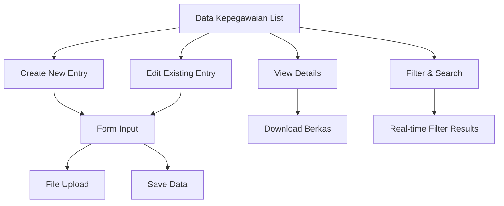

# Product Requirements Document - Data Kepegawaian Module

## 1. Product Overview
Modul Data Kepegawaian adalah sistem manajemen riwayat kepegawaian yang memungkinkan pengelolaan data historis kepegawaian pegawai dengan fitur upload berkas pendukung.
- Modul ini mengelola riwayat kepegawaian pegawai termasuk nomor, tanggal, keterangan, dan berkas pendukung untuk keperluan administrasi HR.
- Target pengguna adalah admin HR, manager, dan supervisor yang memerlukan akses ke data riwayat kepegawaian untuk pengambilan keputusan dan administrasi.

## 2. Core Features

### 2.1 User Roles
| Role | Registration Method | Core Permissions |
|------|---------------------|------------------|
| Super Admin | System assigned | Full access to all data kepegawaian operations |
| Admin HR | Admin invitation | Can create, read, update, delete all data kepegawaian |
| Manager/Supervisor | Admin invitation | Can read and update data kepegawaian in their unit |
| Employee | System registration | Can only view their own data kepegawaian |

### 2.2 Feature Module
Modul Data Kepegawaian terdiri dari halaman-halaman utama berikut:
1. **Data Kepegawaian List**: tabel data, pencarian, filter, pagination, bulk actions.
2. **Form Create/Edit**: input form, file upload, validasi, preview berkas.
3. **Detail View**: informasi lengkap, download berkas, riwayat perubahan.
4. **Import/Export**: import Excel, export PDF/Excel, template download.

### 2.3 Page Details
| Page Name | Module Name | Feature description |
|-----------|-------------|---------------------|
| Data Kepegawaian List | Data Table | Display paginated list with search, filter by employee, date range, sort by columns, bulk delete actions |
| Data Kepegawaian List | Filter Panel | Filter by unit kerja, employee name/NIP, date range, with real-time employee filtering |
| Form Create/Edit | Input Form | Create/edit form with employee selection, nama, tanggal_lahir, nomor, keterangan, file upload for berkas, urut ordering |
| Form Create/Edit | File Upload | Upload berkas with validation (PDF, DOC, DOCX, max 5MB), preview functionality, replace existing files |
| Detail View | Information Display | Show complete data kepegawaian details, employee information, download berkas, audit trail |
| Import/Export | Data Management | Import from Excel template, export to PDF/Excel, download template, validation feedback |

## 3. Core Process
**Admin HR Flow:**
Admin HR dapat mengelola seluruh data kepegawaian, membuat entri baru, mengedit data existing, upload berkas pendukung, dan melakukan import/export data.

**Manager/Supervisor Flow:**
Manager dapat melihat dan mengedit data kepegawaian pegawai di unit kerjanya, download berkas, dan export data unit.

**Employee Flow:**
Pegawai dapat melihat riwayat kepegawaian mereka sendiri dan download berkas yang terkait.



## 4. User Interface Design
### 4.1 Design Style
- Primary colors: Blue (#3B82F6) dan Green (#10B981)
- Secondary colors: Gray (#6B7280) dan White (#FFFFFF)
- Button style: Rounded corners dengan shadow, hover effects
- Font: Inter atau system fonts, sizes 14px-18px untuk content
- Layout style: Card-based design dengan top navigation, sidebar menu
- Icons: Heroicons atau Feather icons untuk konsistensi dengan Filament

### 4.2 Page Design Overview
| Page Name | Module Name | UI Elements |
|-----------|-------------|-------------|
| Data Kepegawaian List | Data Table | Clean table with alternating row colors, action buttons (edit, delete, view), pagination controls, search bar |
| Data Kepegawaian List | Filter Panel | Collapsible filter sidebar, dropdown selects, date pickers, clear filters button |
| Form Create/Edit | Input Form | Two-column layout, labeled inputs, file upload dropzone, validation messages, save/cancel buttons |
| Form Create/Edit | File Upload | Drag-and-drop area, file preview, progress indicator, file type/size validation feedback |
| Detail View | Information Display | Card layout with sections, download buttons, breadcrumb navigation, back to list button |

### 4.3 Responsiveness
Desktop-first design dengan mobile-adaptive layout. Touch interaction optimization untuk mobile devices, collapsible sidebar pada tablet/mobile.

## 5. Technical Specifications

### 5.1 Database Schema
```sql
CREATE TABLE `data_riwayat_kepegawaian` (
  `id` bigint(20) unsigned NOT NULL AUTO_INCREMENT,
  `nik_data_pegawai` varchar(50) NOT NULL,
  `nama` varchar(255) NULL,
  `tanggal_lahir` date NULL,
  `nomor` varchar(255) NULL,
  `keterangan` text NULL,
  `berkas` varchar(255) NULL,
  `urut` int(11) NOT NULL,
  `created_at` timestamp NULL DEFAULT NULL,
  `updated_at` timestamp NULL DEFAULT NULL,
  PRIMARY KEY (`id`),
  KEY `idx_nik_data_pegawai` (`nik_data_pegawai`),
  KEY `idx_urut` (`urut`),
  CONSTRAINT `fk_data_riwayat_kepegawaian_pegawai` FOREIGN KEY (`nik_data_pegawai`) REFERENCES `data_pegawai` (`nik`) ON DELETE CASCADE
);
```

### 5.2 Model Relationships
- **belongsTo**: DataPegawai (via nik_data_pegawai)
- **Accessors**: formatted dates, file URL generation
- **Scopes**: byEmployee, byDateRange, ordered

### 5.3 Validation Rules
- nik_data_pegawai: required, exists in data_pegawai table
- nama: nullable, max 255 characters
- tanggal_lahir: nullable, date format
- nomor: nullable, max 255 characters
- keterangan: nullable, text
- berkas: nullable, file (pdf,doc,docx), max 5MB
- urut: required, integer, min 1

### 5.4 File Upload Specifications
- Allowed formats: PDF, DOC, DOCX
- Maximum file size: 5MB
- Storage location: storage/app/public/kepegawaian/
- Naming convention: {nik}_{timestamp}_{original_name}
- Security: virus scanning, file type validation

### 5.5 API Endpoints
- GET /api/data-riwayat-kepegawaian - List with pagination
- POST /api/data-riwayat-kepegawaian - Create new entry
- GET /api/data-riwayat-kepegawaian/{id} - Get specific entry
- PUT /api/data-riwayat-kepegawaian/{id} - Update entry
- DELETE /api/data-riwayat-kepegawaian/{id} - Delete entry
- GET /api/data-riwayat-kepegawaian/{id}/download - Download berkas

### 5.6 Authorization Matrix
| Role | View All | View Own | Create | Update | Delete | Download |
|------|----------|----------|--------|--------|--------|----------|
| Super Admin | ✓ | ✓ | ✓ | ✓ | ✓ | ✓ |
| Admin HR | ✓ | ✓ | ✓ | ✓ | ✓ | ✓ |
| Manager/Supervisor | Unit Only | ✓ | Unit Only | Unit Only | ✗ | ✓ |
| Employee | ✗ | ✓ | ✗ | ✗ | ✗ | Own Only |

## 6. Implementation Requirements

### 6.1 Components to Create
1. **DataRiwayatKepegawaian Model** - Eloquent model dengan relationships
2. **Migration** - Database schema creation
3. **Factory** - Test data generation
4. **Seeder** - Initial data population
5. **DataRiwayatKepegawaianResource** - Filament resource dengan CRUD
6. **DataRiwayatKepegawaianPolicy** - Authorization rules
7. **DataRiwayatKepegawaianController** - API controller
8. **RolePermissionSeeder** - Permissions untuk resource ini
9. **Unit Tests** - Model dan controller testing

### 6.2 Integration Points
- Menu integration dalam Filament Admin Panel
- File storage integration dengan Laravel Storage
- Role-based access control integration
- Audit logging untuk perubahan data
- Export/Import functionality dengan Excel

### 6.3 Performance Considerations
- Database indexing pada foreign keys dan frequently queried fields
- File upload optimization dengan chunked uploads
- Pagination untuk large datasets
- Caching untuk dropdown options
- Lazy loading untuk relationships