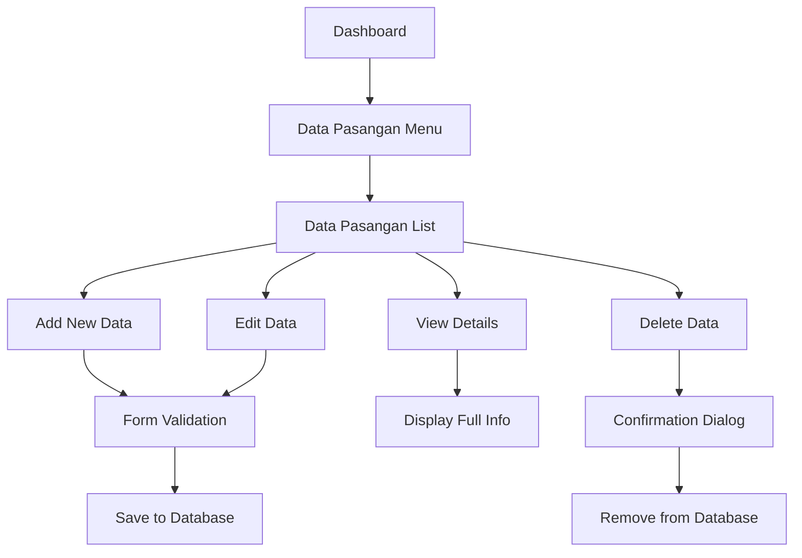

# Product Requirements Document - Data Pasangan Module

## 1. Product Overview
Modul Data Pasangan adalah sistem manajemen informasi pasangan pegawai yang terintegrasi dengan sistem kepegawaian. Modul ini memungkinkan pengelolaan data lengkap pasangan pegawai termasuk informasi personal, pendidikan, dan pekerjaan.
- Mengelola data pasangan pegawai secara terpusat dengan validasi yang ketat dan interface yang user-friendly.
- Target: Meningkatkan efisiensi pengelolaan data keluarga pegawai dan mendukung proses administrasi kepegawaian.

## 2. Core Features

### 2.1 User Roles
| Role | Registration Method | Core Permissions |
|------|---------------------|------------------|
| Super Admin | System assignment | Full access to all data pasangan operations |
| Admin | Admin invitation | Can manage data pasangan for all employees |
| HR Staff | Admin assignment | Can view and edit data pasangan |
| Employee | System registration | Can view own spouse data only |

### 2.2 Feature Module
Modul Data Pasangan terdiri dari halaman-halaman utama berikut:
1. **Data Pasangan List**: tabel data pasangan, filter dan pencarian, pagination.
2. **Form Tambah Data**: input data pasangan baru, validasi field, relasi ke pegawai.
3. **Form Edit Data**: update data pasangan, validasi perubahan, audit trail.
4. **Detail View**: tampilan lengkap data pasangan, informasi relasi, riwayat perubahan.

### 2.3 Page Details
| Page Name | Module Name | Feature description |
|-----------|-------------|---------------------|
| Data Pasangan List | Table Management | Display paginated list of spouse data with search, filter by employee, education, occupation. Sort by name, date, order. Bulk actions for delete. |
| Form Tambah Data | Data Entry Form | Create new spouse record with employee selection, personal info input, education and occupation dropdowns. Real-time validation and error handling. |
| Form Edit Data | Data Update Form | Edit existing spouse data with pre-filled values, change tracking, validation rules. Maintain data integrity and relationships. |
| Detail View | Information Display | Show complete spouse information, related employee data, education and occupation details. Action buttons for edit and delete. |

## 3. Core Process
**Admin/HR Staff Flow:**
1. Admin mengakses menu Data Pasangan dari sidebar navigasi
2. Melihat daftar data pasangan dengan opsi filter berdasarkan pegawai, pendidikan, atau pekerjaan
3. Dapat menambah data pasangan baru dengan memilih pegawai dan mengisi informasi lengkap
4. Melakukan edit data pasangan yang sudah ada dengan validasi otomatis
5. Menghapus data pasangan yang tidak diperlukan dengan konfirmasi

**Employee Flow:**
1. Employee mengakses data pasangan melalui profil personal
2. Melihat informasi pasangan yang terkait dengan akun mereka
3. Dapat mengajukan perubahan data melalui sistem approval



## 4. User Interface Design
### 4.1 Design Style
- Primary colors: Blue (#3B82F6) untuk aksi utama, Gray (#6B7280) untuk teks sekunder
- Button style: Rounded corners dengan shadow, hover effects yang smooth
- Font: Inter atau system font dengan ukuran 14px untuk body text, 16px untuk headers
- Layout style: Card-based design dengan top navigation, sidebar menu yang collapsible
- Icon style: Heroicons atau Feather icons dengan style outline, konsisten di seluruh aplikasi

### 4.2 Page Design Overview
| Page Name | Module Name | UI Elements |
|-----------|-------------|-------------|
| Data Pasangan List | Table Display | Clean table with alternating row colors, search bar with icon, filter dropdowns with multi-select, pagination controls at bottom. Action buttons with consistent spacing. |
| Form Tambah Data | Input Form | Two-column layout for desktop, single column for mobile. Input fields with floating labels, dropdown with search functionality, date picker with calendar icon. Submit button prominently placed. |
| Form Edit Data | Update Form | Similar to add form but with pre-filled values highlighted. Change indicators for modified fields. Save and cancel buttons with clear visual hierarchy. |
| Detail View | Information Card | Card-based layout with sections for personal info, education, and occupation. Clean typography with proper spacing. Edit and delete buttons in header area. |

### 4.3 Responsiveness
Desktop-first design dengan mobile-adaptive layout. Tabel akan menjadi card view pada mobile devices. Touch interaction optimization untuk mobile users dengan larger tap targets dan swipe gestures untuk navigasi.

## 5. Technical Specifications

### 5.1 Database Schema
```sql
CREATE TABLE `data_riwayat_pasangan` (
  `id` bigint(20) unsigned NOT NULL AUTO_INCREMENT,
  `nik_data_pegawai` varchar(50) NOT NULL,
  `nama_pasangan` varchar(255) NULL,
  `tempat_lahir` varchar(20) NULL,
  `tanggal_lahir` date NULL,
  `hubungan` enum('Suami','Istri') NOT NULL,
  `kode_jenjang_pendidikan` varchar(10) NULL,
  `kode_tabel_pekerjaan` varchar(10) NULL,
  `urut` int(11) NOT NULL,
  `created_at` timestamp NULL DEFAULT NULL,
  `updated_at` timestamp NULL DEFAULT NULL,
  PRIMARY KEY (`id`),
  FOREIGN KEY (`nik_data_pegawai`) REFERENCES `data_pegawai`(`nik`),
  FOREIGN KEY (`kode_jenjang_pendidikan`) REFERENCES `jenjang_pendidikan`(`kode`),
  FOREIGN KEY (`kode_tabel_pekerjaan`) REFERENCES `tabel_pekerjaan`(`kode`)
);
```

### 5.2 Model Relationships
- **DataRiwayatPasangan** belongsTo **DataPegawai** (nik_data_pegawai -> nik)
- **DataRiwayatPasangan** belongsTo **JenjangPendidikan** (kode_jenjang_pendidikan -> kode)
- **DataRiwayatPasangan** belongsTo **TabelPekerjaan** (kode_tabel_pekerjaan -> kode)

### 5.3 Validation Rules
- nik_data_pegawai: required, exists in data_pegawai table
- nama_pasangan: nullable, string, max 255 characters
- tempat_lahir: nullable, string, max 20 characters
- tanggal_lahir: nullable, date, before today
- hubungan: required, enum (Suami, Istri)
- kode_jenjang_pendidikan: nullable, exists in jenjang_pendidikan table
- kode_tabel_pekerjaan: nullable, exists in tabel_pekerjaan table
- urut: required, integer, min 1

### 5.4 API Endpoints
- GET /api/data-riwayat-pasangan - List all spouse data with pagination
- POST /api/data-riwayat-pasangan - Create new spouse record
- GET /api/data-riwayat-pasangan/{id} - Get specific spouse data
- PUT /api/data-riwayat-pasangan/{id} - Update spouse data
- DELETE /api/data-riwayat-pasangan/{id} - Delete spouse record

### 5.5 Required Components
1. **Model**: DataRiwayatPasangan with relationships and validation
2. **Migration**: Create data_riwayat_pasangan table with proper indexes
3. **Factory**: Generate test data for development and testing
4. **Seeder**: Populate initial data and demo records
5. **Filament Resource**: Complete CRUD interface with forms and tables
6. **Policy**: Authorization rules for different user roles
7. **Controller**: API endpoints for external integrations
8. **Tests**: Unit and feature tests for all functionality
9. **RolePermissionSeeder**: Specific permissions for this resource

### 5.6 Integration Requirements
- Menu integration in Filament admin panel
- Role-based access control using existing permission system
- Audit logging for data changes
- Export functionality for reports
- Search and filter capabilities
- Real-time validation and error handling