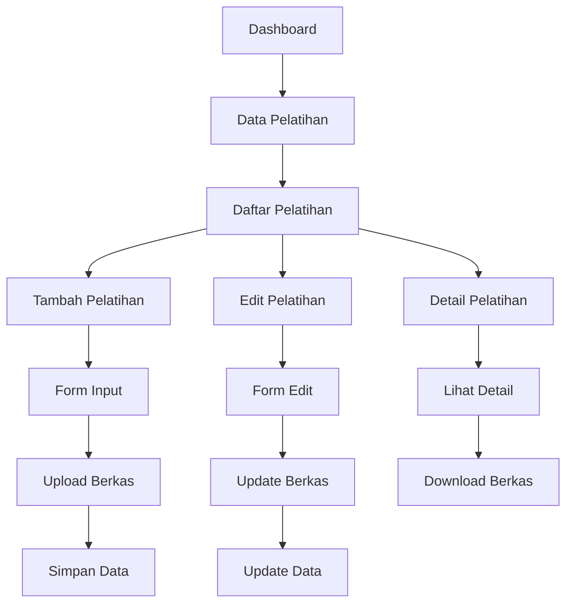

# Product Requirements Document - Data Pelatihan

## 1. Product Overview

Sistem manajemen data pelatihan pegawai yang terintegrasi dengan sistem SIMKA9 untuk mengelola riwayat pelatihan, kursus, dan sertifikasi yang diikuti oleh pegawai. Sistem ini memungkinkan pencatatan, pemantauan, dan pelaporan aktivitas pengembangan kompetensi pegawai secara komprehensif.

Fitur ini dirancang untuk membantu HR dalam melacak investasi pelatihan, memastikan compliance sertifikasi, dan mendukung perencanaan pengembangan karir pegawai berdasarkan riwayat pelatihan yang telah diikuti.

## 2. Core Features

### 2.1 User Roles

| Role        | Registration Method   | Core Permissions                                               |
| ----------- | --------------------- | -------------------------------------------------------------- |
| Super Admin | System assigned       | Full access to all training data across organization           |
| Admin HR    | Admin invitation      | Manage all training records, generate reports, bulk operations |
| Manager     | Department assignment | View and manage training data for department employees         |
| Supervisor  | Unit assignment       | View training data for supervised employees                    |
| Employee    | Standard registration | View personal training history only                            |

### 2.2 Feature Module

Sistem Data Pelatihan terdiri dari halaman-halaman utama berikut:

1. **Daftar Data Pelatihan**: tampilan tabel data pelatihan, filter pencarian, aksi bulk operations
2. **Form Tambah Pelatihan**: input data pelatihan baru, upload berkas sertifikat, validasi data
3. **Form Edit Pelatihan**: modifikasi data pelatihan, update berkas, riwayat perubahan
4. **Detail Pelatihan**: tampilan lengkap informasi pelatihan, preview berkas, metadata

### 2.3 Page Details

| Page Name             | Module Name  | Feature description                                                                                                                                            |
| --------------------- | ------------ | -------------------------------------------------------------------------------------------------------------------------------------------------------------- |
| Daftar Data Pelatihan | Data Table   | Display training records with filtering by employee, training type, date range. Include search functionality, pagination, and bulk actions for data management |
| Form Tambah Pelatihan | Create Form  | Input new training record with employee selection, training details, certificate upload. Validate required fields and file formats                             |
| Form Edit Pelatihan   | Edit Form    | Modify existing training data, update certificate files, maintain audit trail. Support partial updates and validation                                          |
| Detail Pelatihan      | View Details | Show comprehensive training information, certificate preview, download functionality. Display related employee and training type data                          |

## 3. Core Process

### Admin HR Flow

Admin HR dapat mengelola seluruh data pelatihan dalam organisasi. Mereka memulai dari halaman daftar untuk melihat semua record pelatihan, dapat melakukan filter berdasarkan pegawai, jenis pelatihan, atau periode. Admin dapat menambah data pelatihan baru melalui form create, mengedit data existing, dan menghapus record yang tidak diperlukan. Admin juga memiliki akses untuk download berkas sertifikat dan melakukan operasi bulk.

### Manager/Supervisor Flow

Manager dan Supervisor memiliki akses terbatas pada data pelatihan pegawai di unit kerja mereka. Mereka dapat melihat daftar pelatihan, menambah data pelatihan untuk bawahannya, dan melihat detail pelatihan. Akses edit dan delete dibatasi sesuai dengan kebijakan organisasi.

### Employee Flow

Employee hanya dapat melihat riwayat pelatihan pribadi mereka. Mereka dapat mengakses detail pelatihan yang pernah diikuti dan download sertifikat pribadi, namun tidak dapat melakukan perubahan data.



## 4. User Interface Design

### 4.1 Design Style

* **Primary Colors**: Blue (#3B82F6) untuk aksi utama, Green (#10B981) untuk status aktif

* **Secondary Colors**: Gray (#6B7280) untuk teks sekunder, Red (#EF4444) untuk peringatan

* **Button Style**: Rounded corners dengan shadow subtle, hover effects yang smooth

* **Font**: Inter atau system font dengan ukuran 14px untuk body text, 16px untuk headers

* **Layout Style**: Card-based design dengan spacing konsisten, top navigation dengan breadcrumb

* **Icons**: Heroicons outline style untuk konsistensi dengan Filament UI

### 4.2 Page Design Overview

| Page Name             | Module Name  | UI Elements                                                                                                                                                           |
| --------------------- | ------------ | --------------------------------------------------------------------------------------------------------------------------------------------------------------------- |
| Daftar Data Pelatihan | Data Table   | Clean table layout dengan alternating row colors, filter sidebar dengan collapsible sections, action buttons dengan consistent spacing, pagination controls di bottom |
| Form Tambah Pelatihan | Create Form  | Multi-section form dengan fieldsets, file upload area dengan drag-drop support, validation messages dengan clear error states, submit buttons dengan loading states   |
| Form Edit Pelatihan   | Edit Form    | Similar to create form dengan pre-filled values, file replacement interface, change tracking indicators, cancel/save button group                                     |
| Detail Pelatihan      | View Details | Card-based information display, file preview modal, download buttons dengan file type icons, breadcrumb navigation                                                    |

### 4.3 Responsiveness

Aplikasi dirancang desktop-first dengan adaptasi mobile yang optimal. Pada layar mobile, tabel akan menggunakan card layout, form akan menjadi single column, dan navigation akan collapse menjadi hamburger menu. Touch interaction dioptimalkan untuk semua interactive elements dengan minimum touch target 44px.

## 5. Technical Architecture

### 5.1 Database Schema

```sql
CREATE TABLE `data_riwayat_pelatihan` (
  `id` bigint(20) unsigned NOT NULL AUTO_INCREMENT,
  `nik_data_pegawai` varchar(50) NOT NULL,
  `nama` varchar(255) NULL,
  `kode_tabel_jenis_pelatihan` varchar(10) NOT NULL,
  `penyelenggara` varchar(255) NULL,
  `angkatan` varchar(255) NULL,
  `nomor` varchar(255) NULL,
  `tanggal` date NULL,
  `tanggal_sertifikat` date NULL,
  `berkas` varchar(255) NULL,
  `urut` int(11) NOT NULL,
  `created_at` timestamp NULL DEFAULT NULL,
  `updated_at` timestamp NULL DEFAULT NULL,
  PRIMARY KEY (`id`),
  KEY `idx_nik_data_pegawai` (`nik_data_pegawai`),
  KEY `idx_kode_jenis_pelatihan` (`kode_tabel_jenis_pelatihan`),
  KEY `idx_tanggal` (`tanggal`),
  CONSTRAINT `fk_pelatihan_pegawai` FOREIGN KEY (`nik_data_pegawai`) REFERENCES `data_pegawai` (`nik`) ON DELETE CASCADE,
  CONSTRAINT `fk_pelatihan_jenis` FOREIGN KEY (`kode_tabel_jenis_pelatihan`) REFERENCES `tabel_jenis_pelatihan` (`kode`) ON DELETE RESTRICT
);
```

### 5.2 Model Relationships

* **DataRiwayatPelatihan** belongsTo **DataPegawai** (nik\_data\_pegawai -> nik)

* **DataRiwayatPelatihan** belongsTo **TabelJenisPelatihan** (kode\_tabel\_jenis\_pelatihan -> kode)

* **DataPegawai** hasMany **DataRiwayatPelatihan**

* **TabelJenisPelatihan** hasMany **DataRiwayatPelatihan**

### 5.3 File Storage

Berkas sertifikat disimpan menggunakan Laravel Storage dengan konfigurasi:

* **Storage Disk**: public disk untuk akses web

* **Directory Structure**: `training-certificates/{year}/{month}/`

* **File Naming**: `{nik}_{timestamp}_{original_name}`

* **Allowed Types**: PDF, JPG, PNG, JPEG

* **Max Size**: 5MB per file

* **Security**: File validation dan sanitization

### 5.4 Validation Rules

```php
'nik_data_pegawai' => 'required|string|exists:data_pegawai,nik',
'nama' => 'nullable|string|max:255',
'kode_tabel_jenis_pelatihan' => 'required|string|exists:tabel_jenis_pelatihan,kode',
'penyelenggara' => 'nullable|string|max:255',
'angkatan' => 'nullable|string|max:255',
'nomor' => 'nullable|string|max:255',
'tanggal' => 'nullable|date|before_or_equal:today',
'tanggal_sertifikat' => 'nullable|date|after_or_equal:tanggal',
'berkas' => 'nullable|file|mimes:pdf,jpg,jpeg,png|max:5120',
'urut' => 'required|integer|min:1'
```

## 6. Security & Permissions

### 6.1 Role-Based Access Control

```php
// Permissions untuk Data Pelatihan
'data-riwayat-pelatihan.view' => 'View training data',
'data-riwayat-pelatihan.create' => 'Create training records',
'data-riwayat-pelatihan.edit' => 'Edit training records',
'data-riwayat-pelatihan.delete' => 'Delete training records',
'data-riwayat-pelatihan.download' => 'Download certificates',
'data-riwayat-pelatihan.bulk' => 'Bulk operations'
```

### 6.2 Data Access Rules

* **Super Admin**: Full access to all training data

* **Admin HR**: Access to all training data with CRUD operations

* **Manager**: Access to department training data with limited edit rights

* **Supervisor**: View access to supervised employees' training data

* **Employee**: View access to personal training data only

### 6.3 File Security

* File upload validation untuk mencegah malicious files

* Secure file naming untuk mencegah path traversal

* Access control pada file download berdasarkan user permissions

* Regular cleanup untuk orphaned files

## 7. Performance Considerations

### 7.1 Database Optimization

* Index pada kolom yang sering diquery (nik\_data\_pegawai, tanggal, kode\_jenis\_pelatihan)

* Pagination untuk large datasets

* Eager loading untuk relationships

* Query optimization untuk complex filters

### 7.2 File Handling

* Lazy loading untuk file previews

* Thumbnail generation untuk image certificates

* CDN integration untuk file delivery

* Background processing untuk bulk file operations

## 8. Testing Strategy

### 8.1 Unit Tests

* Model validation tests

* Relationship tests

* File upload functionality tests

* Permission and policy tests

### 8.2 Feature Tests

* CRUD operations testing

* File upload and download testing

* Access control testing

* API endpoint testing

### 8.3 Integration Tests

* End-to-end workflow testing

* Cross-browser compatibility

* Performance testing under load

* Security penetration testing

## 9. Deployment & Maintenance

### 9.1 Migration Strategy

* Incremental migration dengan rollback capability

* Data seeding untuk initial setup

* Permission seeding untuk role setup

* Index creation untuk performance

### 9.2 Monitoring

* Application performance monitoring

* File storage usage monitoring

* User activity logging

* Error tracking dan alerting

### 9.3 Backup & Recovery

* Regular database backups

* File storage backups

* Disaster recovery procedures

* Data retention policies

