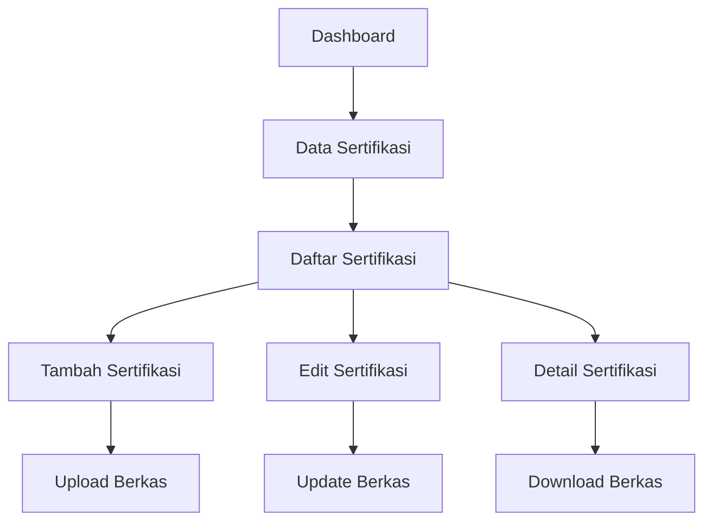

# Product Requirements Document - Data Sertifikasi

## 1. Product Overview
Sistem manajemen data sertifikasi pegawai yang terintegrasi dengan aplikasi SIMKA9 untuk mengelola informasi sertifikat dan kredensial profesional pegawai.
- Memungkinkan pencatatan, pengelolaan, dan pelacakan sertifikasi pegawai dengan dukungan upload berkas digital
- Target pengguna: Administrator HR, Staff Kepegawaian, dan Pegawai untuk mengelola data sertifikasi mereka

## 2. Core Features

### 2.1 User Roles
| Role | Registration Method | Core Permissions |
|------|---------------------|------------------|
| Super Admin | System assigned | Full CRUD access to all certification data |
| HR Admin | Admin invitation | Create, read, update certification data |
| Staff Kepegawaian | Admin invitation | Read and update assigned employee certifications |
| Pegawai | Employee registration | Read own certification data |

### 2.2 Feature Module
Sistem Data Sertifikasi terdiri dari halaman-halaman utama berikut:
1. **Daftar Sertifikasi**: tampilan tabel data sertifikasi, pencarian dan filter, aksi CRUD
2. **Tambah Sertifikasi**: form input data sertifikasi baru, upload berkas sertifikat
3. **Edit Sertifikasi**: form edit data sertifikasi, update berkas sertifikat
4. **Detail Sertifikasi**: tampilan detail lengkap sertifikasi, preview berkas

### 2.3 Page Details
| Page Name | Module Name | Feature description |
|-----------|-------------|---------------------|
| Daftar Sertifikasi | Data Table | Display certification list with search, filter by employee, certification type, year. Bulk actions for export and delete |
| Tambah Sertifikasi | Create Form | Input employee selection, certification details (name, number, year), inpassing information, file upload with validation |
| Edit Sertifikasi | Edit Form | Update certification information, replace certificate file, maintain data integrity with validation |
| Detail Sertifikasi | View Details | Show complete certification information, download certificate file, view related employee data |

## 3. Core Process
**Admin Flow:**
1. Admin mengakses menu Data Sertifikasi dari dashboard utama
2. Melihat daftar sertifikasi dengan opsi pencarian dan filter
3. Dapat menambah sertifikasi baru dengan memilih pegawai dan mengisi detail
4. Upload berkas sertifikat dalam format PDF/JPG/PNG
5. Edit atau hapus data sertifikasi yang sudah ada
6. Download berkas sertifikat untuk verifikasi

**Employee Flow:**
1. Pegawai login dan mengakses data sertifikasi pribadi
2. Melihat daftar sertifikasi yang dimiliki
3. Download berkas sertifikat untuk keperluan administrasi



## 4. User Interface Design

### 4.1 Design Style
- Primary colors: Blue (#3B82F6), Green (#10B981) untuk status aktif
- Secondary colors: Gray (#6B7280) untuk teks sekunder, Red (#EF4444) untuk aksi hapus
- Button style: Rounded corners (8px), solid background dengan hover effects
- Font: Inter atau system font, ukuran 14px untuk body text, 16px untuk headers
- Layout style: Card-based design dengan clean spacing, top navigation dengan breadcrumbs
- Icon style: Heroicons outline untuk konsistensi dengan Filament UI

### 4.2 Page Design Overview
| Page Name | Module Name | UI Elements |
|-----------|-------------|-------------|
| Daftar Sertifikasi | Data Table | Clean table with alternating row colors, search bar with filters, action buttons with icons, pagination controls |
| Tambah Sertifikasi | Create Form | Two-column form layout, grouped fields in sections, file upload dropzone with preview, save/cancel buttons |
| Edit Sertifikasi | Edit Form | Similar to create form with pre-filled data, file replacement option, update/cancel buttons |
| Detail Sertifikasi | View Details | Card-based layout showing certification info, employee details section, file preview/download area |

### 4.3 Responsiveness
Desktop-first design dengan mobile-adaptive layout. Touch-friendly buttons dan form elements untuk tablet usage. Responsive table dengan horizontal scroll pada mobile devices.

## 5. Technical Requirements

### 5.1 Database Schema
```sql
CREATE TABLE `data_riwayat_sertifikasi` (
  `id` bigint(20) unsigned NOT NULL AUTO_INCREMENT,
  `nik_data_pegawai` varchar(50) NOT NULL,
  `is_sertifikasi` enum('Ya','Tidak') NULL,
  `nama` varchar(100) NULL,
  `nomor` varchar(50) NULL,
  `tahun` varchar(5) NULL,
  `induk_inpasing` varchar(255) NULL,
  `sk_inpasing` varchar(255) NULL,
  `tahun_inpasing` varchar(5) NULL,
  `berkas` varchar(255) NULL,
  `urut` int(11) NOT NULL,
  `created_at` timestamp NULL DEFAULT NULL,
  `updated_at` timestamp NULL DEFAULT NULL,
  PRIMARY KEY (`id`),
  KEY `idx_nik_data_pegawai` (`nik_data_pegawai`),
  KEY `idx_tahun` (`tahun`),
  KEY `idx_urut` (`urut`)
);
```

### 5.2 Validation Rules
- `nik_data_pegawai`: required, exists in data_pegawai table
- `is_sertifikasi`: nullable, enum validation
- `nama`: nullable, max 100 characters
- `nomor`: nullable, max 50 characters, unique per employee
- `tahun`: nullable, 4-digit year format, not future year
- `berkas`: nullable, file validation (PDF, JPG, PNG, max 5MB)
- `urut`: required, integer, positive number

### 5.3 File Upload Specifications
- Allowed formats: PDF, JPG, JPEG, PNG
- Maximum file size: 5MB
- Storage location: `storage/app/public/sertifikasi/`
- File naming: `{nik}_{timestamp}_{original_name}`
- Security: File type validation, virus scanning (if available)

### 5.4 API Endpoints
- `GET /api/data-riwayat-sertifikasi` - List certifications with pagination
- `POST /api/data-riwayat-sertifikasi` - Create new certification
- `GET /api/data-riwayat-sertifikasi/{id}` - Get certification details
- `PUT /api/data-riwayat-sertifikasi/{id}` - Update certification
- `DELETE /api/data-riwayat-sertifikasi/{id}` - Delete certification
- `GET /api/data-riwayat-sertifikasi/{id}/download` - Download certificate file

### 5.5 Role-Based Access Control
- Super Admin: Full CRUD access to all certifications
- HR Admin: CRUD access with department restrictions
- Staff Kepegawaian: Read/Update access for assigned employees
- Pegawai: Read-only access to own certifications

## 6. Testing Strategy

### 6.1 Unit Testing
- Model validation testing
- Relationship testing (Employee, Certification)
- File upload functionality testing
- API endpoint response testing

### 6.2 Integration Testing
- Filament Resource CRUD operations
- File upload and download workflows
- Permission and role-based access testing
- Database transaction integrity testing

### 6.3 User Acceptance Testing
- Admin workflow testing for certification management
- Employee access testing for viewing own certifications
- File upload/download functionality verification
- Search and filter functionality validation

## 7. Implementation Checklist

### 7.1 Backend Components
- [ ] DataRiwayatSertifikasi Model with relationships
- [ ] Database migration with proper indexes
- [ ] Factory for test data generation
- [ ] Seeder for initial data and permissions
- [ ] Policy for role-based access control
- [ ] API Controller with comprehensive validation
- [ ] Unit tests for all components

### 7.2 Frontend Components
- [ ] Filament Resource with CRUD operations
- [ ] Form schema with file upload support
- [ ] Table schema with search and filters
- [ ] Custom pages for Create, Edit, List, View
- [ ] File download functionality
- [ ] Responsive design implementation

### 7.3 Integration Requirements
- [ ] Menu integration in Filament navigation
- [ ] Permission seeder for role management
- [ ] File storage configuration
- [ ] Route registration for file downloads
- [ ] Error handling and user feedback
- [ ] Documentation and code comments