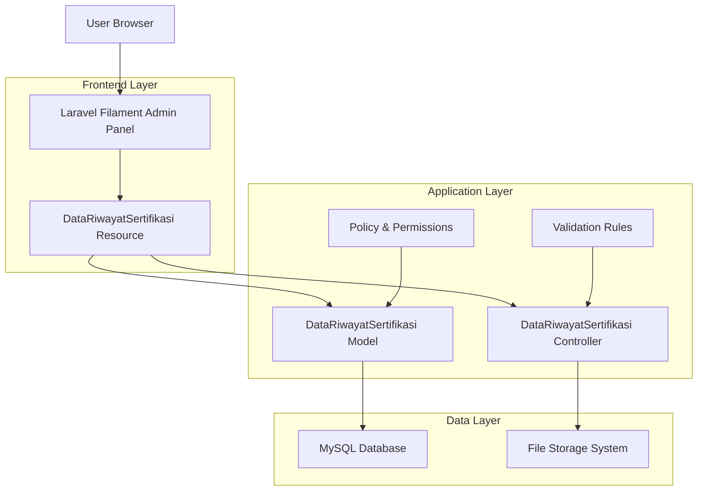
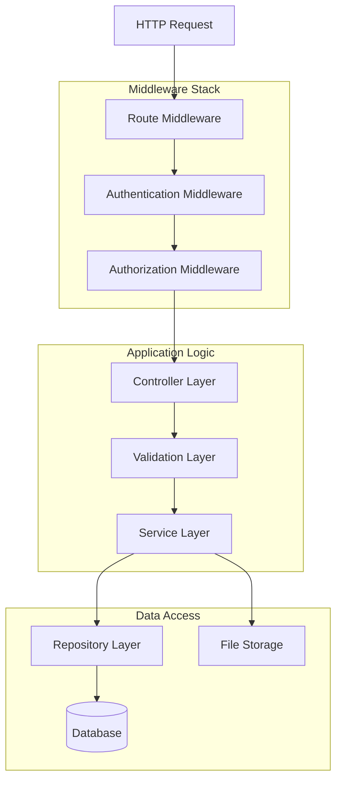
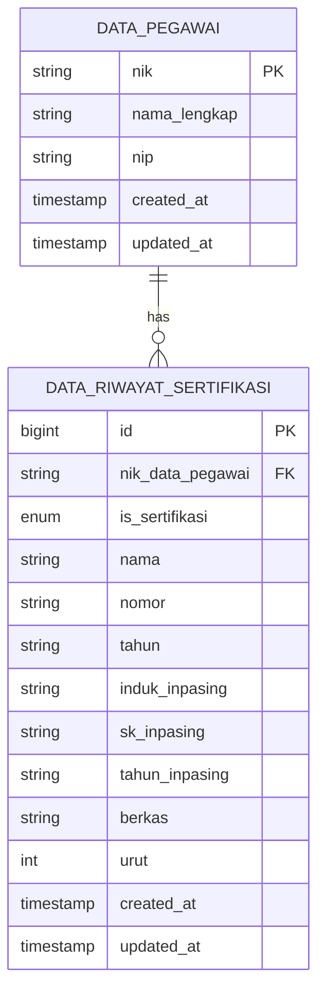

# Technical Architecture Document - Data Sertifikasi

## 1. Architecture Design



## 2. Technology Description

* Frontend: Laravel Filament\@3 + Livewire\@3 + Alpine.js + Tailwind CSS

* Backend: Laravel\@10 + PHP\@8.1+

* Database: MySQL\@8.0

* File Storage: Laravel Storage (Local/S3 compatible)

* Authentication: Laravel Sanctum + Filament Auth

## 3. Route Definitions

| Route                                          | Purpose                                                 |
| ---------------------------------------------- | ------------------------------------------------------- |
| /admin/data-riwayat-sertifikasis               | Main certification management page with CRUD operations |
| /admin/data-riwayat-sertifikasis/create        | Create new certification record                         |
| /admin/data-riwayat-sertifikasis/{id}/edit     | Edit existing certification record                      |
| /admin/data-riwayat-sertifikasis/{id}          | View certification details                              |
| /admin/data-riwayat-sertifikasis/{id}/download | Download certification file                             |

## 4. API Definitions

### 4.1 Core API

**Certification Management**

```
GET /api/data-riwayat-sertifikasi
```

Request Parameters:

| Param Name   | Param Type | isRequired | Description                               |
| ------------ | ---------- | ---------- | ----------------------------------------- |
| page         | integer    | false      | Page number for pagination                |
| per\_page    | integer    | false      | Records per page (default: 15)            |
| search       | string     | false      | Search term for certification name/number |
| nik\_pegawai | string     | false      | Filter by employee NIK                    |
| tahun        | string     | false      | Filter by certification year              |

Response:

| Param Name | Param Type | Description                    |
| ---------- | ---------- | ------------------------------ |
| data       | array      | Array of certification records |
| meta       | object     | Pagination metadata            |
| status     | boolean    | Response status                |

Example Response:

```json
{
  "data": [
    {
      "id": 1,
      "nik_data_pegawai": "1234567890",
      "is_sertifikasi": "Ya",
      "nama": "Certified Project Manager",
      "nomor": "CPM-2023-001",
      "tahun": "2023",
      "berkas": "sertifikasi/1234567890_1698765432_certificate.pdf",
      "pegawai": {
        "nama_lengkap": "John Doe",
        "nip": "198501012010011001"
      }
    }
  ],
  "meta": {
    "current_page": 1,
    "total": 50,
    "per_page": 15
  },
  "status": true
}
```

```
POST /api/data-riwayat-sertifikasi
```

Request:

| Param Name         | Param Type | isRequired | Description                             |
| ------------------ | ---------- | ---------- | --------------------------------------- |
| nik\_data\_pegawai | string     | true       | Employee NIK reference                  |
| is\_sertifikasi    | string     | false      | Certification status (Ya/Tidak)         |
| nama               | string     | false      | Certification name                      |
| nomor              | string     | false      | Certificate number                      |
| tahun              | string     | false      | Certification year                      |
| induk\_inpasing    | string     | false      | Inpassing parent reference              |
| sk\_inpasing       | string     | false      | Inpassing decree                        |
| tahun\_inpasing    | string     | false      | Inpassing year                          |
| berkas             | file       | false      | Certificate file (PDF/JPG/PNG, max 5MB) |
| urut               | integer    | true       | Sort order                              |

```
PUT /api/data-riwayat-sertifikasi/{id}
```

Request: Same as POST with optional file replacement

```
DELETE /api/data-riwayat-sertifikasi/{id}
```

Response:

| Param Name | Param Type | Description           |
| ---------- | ---------- | --------------------- |
| message    | string     | Success/error message |
| status     | boolean    | Operation status      |

```
GET /api/data-riwayat-sertifikasi/{id}/download
```

Response: File download stream

## 5. Server Architecture Diagram



## 6. Data Model

### 6.1 Data Model Definition



### 6.2 Data Definition Language

**DataRiwayatSertifikasi Table**

```sql
-- Create table
CREATE TABLE `data_riwayat_sertifikasi` (
    `id` bigint(20) unsigned NOT NULL AUTO_INCREMENT,
    `nik_data_pegawai` varchar(50) NOT NULL,
    `is_sertifikasi` enum('Ya','Tidak') NULL,
    `nama` varchar(100) NULL,
    `nomor` varchar(50) NULL,
    `tahun` varchar(5) NULL,
    `induk_inpasing` varchar(255) NULL,
    `sk_inpasing` varchar(255) NULL,
    `tahun_inpasing` varchar(5) NULL,
    `berkas` varchar(255) NULL,
    `urut` int(11) NOT NULL,
    `created_at` timestamp NULL DEFAULT NULL,
    `updated_at` timestamp NULL DEFAULT NULL,
    PRIMARY KEY (`id`),
    KEY `idx_nik_data_pegawai` (`nik_data_pegawai`),
    KEY `idx_tahun` (`tahun`),
    KEY `idx_urut` (`urut`),
    CONSTRAINT `fk_data_riwayat_sertifikasi_pegawai` 
        FOREIGN KEY (`nik_data_pegawai`) 
        REFERENCES `data_pegawai` (`nik`) 
        ON DELETE CASCADE ON UPDATE CASCADE
) ENGINE=InnoDB DEFAULT CHARSET=utf8mb4 COLLATE=utf8mb4_unicode_ci;

-- Create indexes for performance
CREATE INDEX `idx_data_riwayat_sertifikasi_nama` ON `data_riwayat_sertifikasi`(`nama`);
CREATE INDEX `idx_data_riwayat_sertifikasi_nomor` ON `data_riwayat_sertifikasi`(`nomor`);
CREATE INDEX `idx_data_riwayat_sertifikasi_is_sertifikasi` ON `data_riwayat_sertifikasi`(`is_sertifikasi`);

-- Initial data (sample)
INSERT INTO `data_riwayat_sertifikasi` (
    `nik_data_pegawai`, 
    `is_sertifikasi`, 
    `nama`, 
    `nomor`, 
    `tahun`, 
    `urut`
) VALUES 
('1234567890', 'Ya', 'Certified Project Manager', 'CPM-2023-001', '2023', 1),
('1234567890', 'Ya', 'ISO 9001 Lead Auditor', 'ISO-2022-045', '2022', 2),
('0987654321', 'Ya', 'Microsoft Azure Certified', 'AZ-900-2023', '2023', 1);
```

**Permissions and Roles Setup**

```sql
-- Insert permissions for DataRiwayatSertifikasi
INSERT INTO `permissions` (`name`, `guard_name`, `created_at`, `updated_at`) VALUES
('view_data::riwayat::sertifikasi', 'web', NOW(), NOW()),
('view_any_data::riwayat::sertifikasi', 'web', NOW(), NOW()),
('create_data::riwayat::sertifikasi', 'web', NOW(), NOW()),
('update_data::riwayat::sertifikasi', 'web', NOW(), NOW()),
('delete_data::riwayat::sertifikasi', 'web', NOW(), NOW()),
('delete_any_data::riwayat::sertifikasi', 'web', NOW(), NOW());

-- Assign permissions to roles
INSERT INTO `role_has_permissions` (`permission_id`, `role_id`)
SELECT p.id, r.id 
FROM `permissions` p, `roles` r 
WHERE p.name LIKE '%data::riwayat::sertifikasi%' 
AND r.name IN ('super_admin', 'admin', 'hr_admin');
```

## 7. File Storage Configuration

### 7.1 Storage Structure

```
storage/
├── app/
│   └── public/
│       └── sertifikasi/
│           ├── {nik}/
│           │   ├── {timestamp}_{filename}.pdf
│           │   └── {timestamp}_{filename}.jpg
│           └── temp/
└── logs/
    └── file_operations.log
```

### 7.2 File Naming Convention

* Format: `{nik_pegawai}_{timestamp}_{sanitized_original_name}`

* Example: `1234567890_1698765432_certificate_project_manager.pdf`

### 7.3 Security Measures

* File type validation using MIME type checking

* File size limitation (5MB maximum)

* Virus scanning integration (optional)

* Access control through Laravel policies

* Secure file serving through controller authentication

## 8. Performance Considerations

### 8.1 Database Optimization

* Proper indexing on frequently queried columns

* Query optimization for large datasets

* Database connection pooling

* Pagination for large result sets

### 8.2 File Storage Optimization

* CDN integration for file serving

* Image optimization for preview thumbnails

* Lazy loading for file listings

* Caching for frequently accessed files

### 8.3 Application Performance

* Laravel caching for configuration and routes

* Eloquent relationship eager loading

* Query result caching for static data

* Asset optimization and minification

