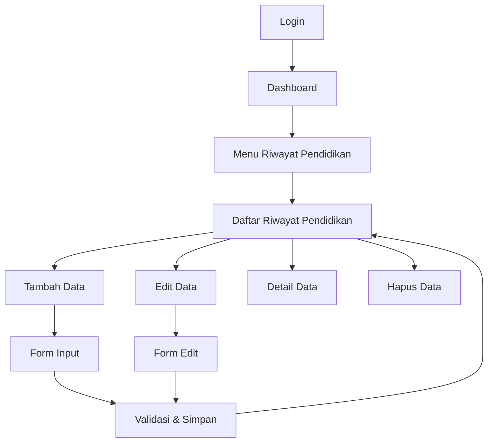

# Product Requirements Document - Riwayat Pendidikan

## 1. Product Overview

Fitur "Riwayat Pendidikan" adalah modul manajemen data riwayat pendidikan pegawai yang terintegrasi dengan sistem SIMKA9 (Sistem Informasi Manajemen Kepegawaian). Fitur ini memungkinkan pengelolaan data pendidikan formal yang pernah ditempuh oleh setiap pegawai dengan struktur data yang terorganisir dan relasi yang jelas dengan data pegawai dan jenjang pendidikan.

Fitur ini dirancang untuk memenuhi kebutuhan administrasi kepegawaian dalam mengelola riwayat pendidikan pegawai secara digital, menggantikan sistem manual yang rentan terhadap kehilangan data dan kesalahan pencatatan.

## 2. Core Features

### 2.1 User Roles

| Role | Registration Method | Core Permissions |
|------|---------------------|------------------|
| Admin | System assignment | Full CRUD access untuk semua data riwayat pendidikan |
| HR Manager | Admin invitation | Create, read, update data riwayat pendidikan |
| User/Pegawai | System registration | Read access untuk data riwayat pendidikan sendiri |

### 2.2 Feature Module

Fitur Riwayat Pendidikan terdiri dari halaman-halaman utama berikut:

1. **Halaman Daftar Riwayat Pendidikan**: tampilan tabel data, filter pencarian, sorting, dan pagination
2. **Halaman Detail Riwayat Pendidikan**: informasi lengkap riwayat pendidikan, relasi dengan pegawai dan jenjang pendidikan
3. **Halaman Tambah Riwayat Pendidikan**: form input data baru dengan validasi
4. **Halaman Edit Riwayat Pendidikan**: form modifikasi data existing dengan validasi

### 2.3 Page Details

| Page Name | Module Name | Feature description |
|-----------|-------------|---------------------|
| Daftar Riwayat Pendidikan | Data Table | Menampilkan tabel dengan kolom NIK pegawai, nama pegawai, jenjang pendidikan, nama sekolah, tahun ijazah, dan urutan. Dilengkapi filter berdasarkan jenjang pendidikan, tahun ijazah, dan pencarian nama pegawai/sekolah |
| Detail Riwayat Pendidikan | Detail View | Menampilkan informasi lengkap riwayat pendidikan termasuk data pegawai terkait, jenjang pendidikan, nama sekolah, tahun ijazah, dan urutan prioritas |
| Tambah Riwayat Pendidikan | Create Form | Form input dengan field NIK pegawai (dropdown/select), jenjang pendidikan (dropdown), nama sekolah (text input), tahun ijazah (year picker), dan urutan (number input). Dilengkapi validasi real-time |
| Edit Riwayat Pendidikan | Edit Form | Form modifikasi data existing dengan pre-filled values, validasi yang sama dengan form create, dan konfirmasi perubahan |

## 3. Core Process

### Admin/HR Manager Flow
1. Login ke sistem admin Filament
2. Navigasi ke menu "Riwayat Pendidikan"
3. Melihat daftar semua riwayat pendidikan pegawai
4. Dapat melakukan filter berdasarkan jenjang pendidikan atau tahun ijazah
5. Menambah data riwayat pendidikan baru melalui tombol "Tambah"
6. Mengisi form dengan memilih pegawai, jenjang pendidikan, nama sekolah, tahun ijazah, dan urutan
7. Menyimpan data dengan validasi otomatis
8. Mengedit atau menghapus data existing sesuai kebutuhan

### User/Pegawai Flow
1. Login ke sistem
2. Navigasi ke menu "Riwayat Pendidikan"
3. Melihat daftar riwayat pendidikan pribadi
4. Melihat detail riwayat pendidikan tertentu

## 4. User Interface Design

### 4.1 Design Style

- **Primary Colors**: Blue (#3B82F6) untuk elemen utama, Green (#10B981) untuk aksi positif
- **Secondary Colors**: Gray (#6B7280) untuk teks sekunder, Red (#EF4444) untuk peringatan
- **Button Style**: Rounded corners (8px), solid background dengan hover effects
- **Font**: Inter atau system font dengan ukuran 14px untuk body text, 16px untuk headings
- **Layout Style**: Card-based layout dengan clean spacing, top navigation dengan sidebar
- **Icons**: Heroicons atau Feather icons untuk konsistensi dengan Filament

### 4.2 Page Design Overview

| Page Name | Module Name | UI Elements |
|-----------|-------------|-------------|
| Daftar Riwayat Pendidikan | Data Table | Table dengan header sticky, pagination di bawah, filter sidebar kiri, search bar di atas tabel, action buttons (tambah, edit, hapus) dengan icon |
| Detail Riwayat Pendidikan | Detail Card | Card layout dengan informasi tersusun dalam grid 2 kolom, breadcrumb navigation, back button, edit button di header |
| Tambah Riwayat Pendidikan | Form Card | Single column form dengan label di atas field, dropdown dengan search functionality, date picker untuk tahun ijazah, number input dengan spinner untuk urutan |
| Edit Riwayat Pendidikan | Form Card | Layout sama dengan form tambah, pre-filled values, highlight untuk field yang diubah, cancel dan save buttons |

### 4.3 Responsiveness

Aplikasi menggunakan pendekatan desktop-first dengan adaptasi mobile. Pada layar mobile (< 768px), tabel akan menggunakan card layout dengan informasi penting ditampilkan secara vertikal. Form akan menggunakan single column layout dengan spacing yang disesuaikan untuk touch interaction.