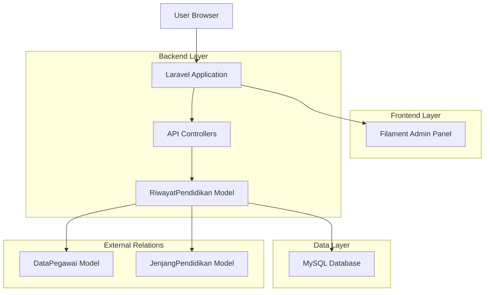
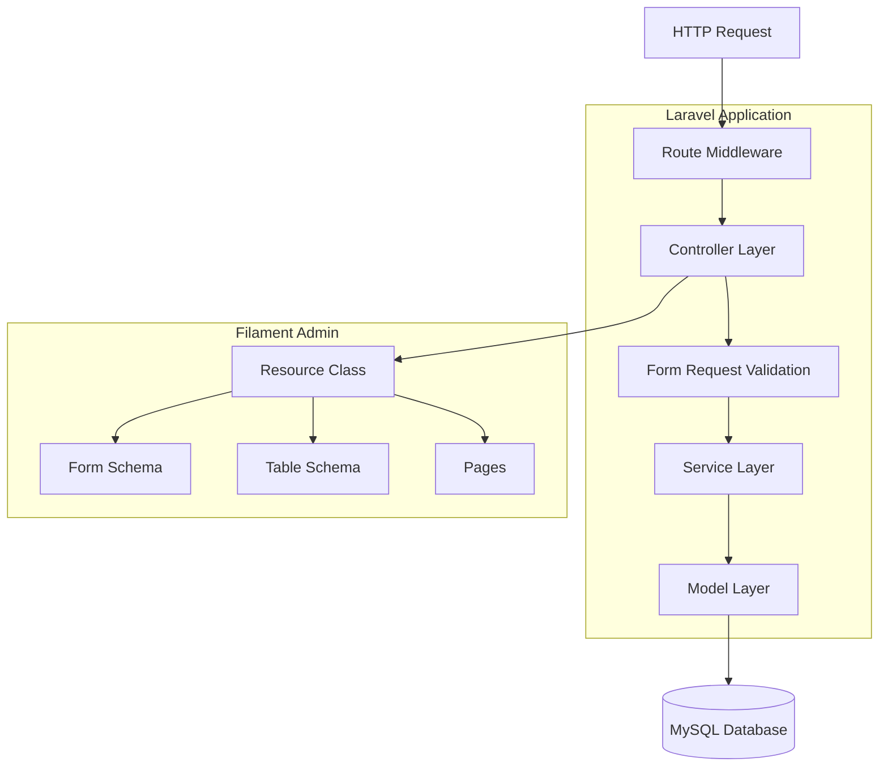
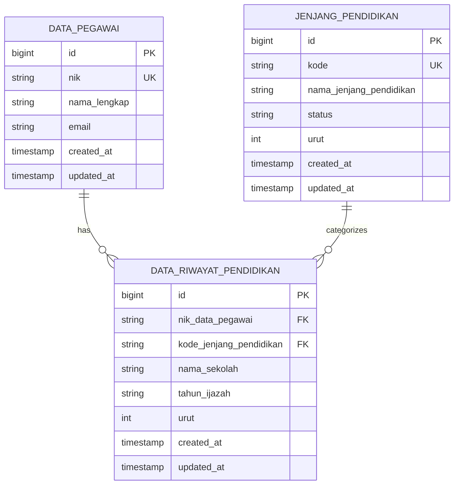

# Technical Architecture Document - Riwayat Pendidikan

## 1. Architecture Design



## 2. Technology Description

- **Frontend**: Filament v3 + Livewire + Alpine.js + Tailwind CSS
- **Backend**: Laravel v11 + PHP 8.2+
- **Database**: MySQL 8.0+
- **Testing**: PHPUnit + Laravel Testing Framework
- **Validation**: Laravel Form Request Validation
- **Authentication**: Laravel Sanctum (untuk API)

## 3. Route Definitions

| Route | Purpose |
|-------|---------|
| /admin/riwayat-pendidikan | Halaman utama daftar riwayat pendidikan (Filament) |
| /admin/riwayat-pendidikan/create | Halaman tambah riwayat pendidikan baru (Filament) |
| /admin/riwayat-pendidikan/{id}/edit | Halaman edit riwayat pendidikan (Filament) |
| /admin/riwayat-pendidikan/{id} | Halaman detail riwayat pendidikan (Filament) |
| /api/riwayat-pendidikan | API endpoint untuk CRUD operations |

## 4. API Definitions

### 4.1 Core API

**Riwayat Pendidikan Management**

```
GET /api/riwayat-pendidikan
```
Response:
| Param Name | Param Type | Description |
|------------|------------|-------------|
| success | boolean | Status response |
| message | string | Response message |
| data | object | Paginated riwayat pendidikan data |

```
POST /api/riwayat-pendidikan
```
Request:
| Param Name | Param Type | isRequired | Description |
|------------|------------|------------|-------------|
| nik_data_pegawai | string | true | NIK pegawai (foreign key) |
| kode_jenjang_pendidikan | string | true | Kode jenjang pendidikan (foreign key) |
| nama_sekolah | string | true | Nama sekolah/institusi pendidikan |
| tahun_ijazah | string | true | Tahun kelulusan/ijazah |
| urut | integer | true | Urutan prioritas |

Response:
| Param Name | Param Type | Description |
|------------|------------|-------------|
| success | boolean | Status response |
| message | string | Response message |
| data | object | Created riwayat pendidikan data |

```
GET /api/riwayat-pendidikan/{id}
```
Response:
| Param Name | Param Type | Description |
|------------|------------|-------------|
| success | boolean | Status response |
| message | string | Response message |
| data | object | Riwayat pendidikan detail with relations |

```
PUT /api/riwayat-pendidikan/{id}
```
Request: Same as POST request
Response: Same as POST response

```
DELETE /api/riwayat-pendidikan/{id}
```
Response:
| Param Name | Param Type | Description |
|------------|------------|-------------|
| success | boolean | Status response |
| message | string | Response message |

Example Request:
```json
{
  "nik_data_pegawai": "1234567890123456",
  "kode_jenjang_pendidikan": "S1",
  "nama_sekolah": "Universitas Indonesia",
  "tahun_ijazah": "2020",
  "urut": 1
}
```

Example Response:
```json
{
  "success": true,
  "message": "Data riwayat pendidikan berhasil disimpan",
  "data": {
    "id": 1,
    "nik_data_pegawai": "1234567890123456",
    "kode_jenjang_pendidikan": "S1",
    "nama_sekolah": "Universitas Indonesia",
    "tahun_ijazah": "2020",
    "urut": 1,
    "created_at": "2025-01-27T10:00:00.000000Z",
    "updated_at": "2025-01-27T10:00:00.000000Z",
    "pegawai": {
      "nik": "1234567890123456",
      "nama_lengkap": "John Doe"
    },
    "jenjang_pendidikan": {
      "kode": "S1",
      "nama_jenjang_pendidikan": "Sarjana"
    }
  }
}
```

## 5. Server Architecture Diagram



## 6. Data Model

### 6.1 Data Model Definition



### 6.2 Data Definition Language

**Riwayat Pendidikan Table (data_riwayat_pendidikan)**

```sql
-- Create table
CREATE TABLE data_riwayat_pendidikan (
    id BIGINT(20) UNSIGNED NOT NULL AUTO_INCREMENT PRIMARY KEY,
    nik_data_pegawai VARCHAR(50) NOT NULL COMMENT 'NIK pegawai dari tabel data_pegawai',
    kode_jenjang_pendidikan VARCHAR(50) NOT NULL COMMENT 'Kode jenjang pendidikan dari tabel jenjang_pendidikan',
    nama_sekolah VARCHAR(255) NOT NULL COMMENT 'Nama sekolah/institusi pendidikan',
    tahun_ijazah VARCHAR(20) NOT NULL COMMENT 'Tahun kelulusan/ijazah',
    urut INT(11) NOT NULL COMMENT 'Urutan prioritas pendidikan',
    created_at TIMESTAMP NULL DEFAULT NULL,
    updated_at TIMESTAMP NULL DEFAULT NULL
);

-- Create indexes for better performance
CREATE INDEX idx_riwayat_pendidikan_nik ON data_riwayat_pendidikan(nik_data_pegawai);
CREATE INDEX idx_riwayat_pendidikan_jenjang ON data_riwayat_pendidikan(kode_jenjang_pendidikan);
CREATE INDEX idx_riwayat_pendidikan_tahun ON data_riwayat_pendidikan(tahun_ijazah);
CREATE INDEX idx_riwayat_pendidikan_urut ON data_riwayat_pendidikan(urut);

-- Create foreign key constraints (logical references)
-- Note: Physical foreign keys are avoided as per project guidelines
-- Logical foreign key: nik_data_pegawai REFERENCES data_pegawai(nik)
-- Logical foreign key: kode_jenjang_pendidikan REFERENCES jenjang_pendidikan(kode)

-- Initial seed data
INSERT INTO data_riwayat_pendidikan (nik_data_pegawai, kode_jenjang_pendidikan, nama_sekolah, tahun_ijazah, urut) VALUES
('1234567890123456', 'SMA', 'SMA Negeri 1 Jakarta', '2015', 1),
('1234567890123456', 'S1', 'Universitas Indonesia', '2019', 2),
('1234567890123456', 'S2', 'Institut Teknologi Bandung', '2021', 3),
('2345678901234567', 'SMA', 'SMA Negeri 2 Bandung', '2016', 1),
('2345678901234567', 'S1', 'Universitas Padjadjaran', '2020', 2);
```

**Model Relationships:**

```php
// RiwayatPendidikan Model
public function pegawai()
{
    return $this->belongsTo(DataPegawai::class, 'nik_data_pegawai', 'nik');
}

public function jenjangPendidikan()
{
    return $this->belongsTo(JenjangPendidikan::class, 'kode_jenjang_pendidikan', 'kode');
}

// DataPegawai Model
public function riwayatPendidikan()
{
    return $this->hasMany(RiwayatPendidikan::class, 'nik_data_pegawai', 'nik');
}

// JenjangPendidikan Model
public function riwayatPendidikan()
{
    return $this->hasMany(RiwayatPendidikan::class, 'kode_jenjang_pendidikan', 'kode');
}
```

**Security Considerations:**

1. **Input Validation**: Semua input divalidasi menggunakan Laravel Form Request
2. **SQL Injection Prevention**: Menggunakan Eloquent ORM dan prepared statements
3. **Authorization**: Implementasi policy untuk kontrol akses berdasarkan role
4. **Rate Limiting**: API endpoints dilindungi dengan rate limiting
5. **CSRF Protection**: Form dilindungi dengan CSRF token
6. **Data Sanitization**: Input data disanitasi sebelum disimpan ke database

**Testing Strategy:**

1. **Unit Tests**: Test untuk model relationships dan business logic
2. **Feature Tests**: Test untuk API endpoints dan form submissions
3. **Integration Tests**: Test untuk interaksi antar komponen
4. **Browser Tests**: Test untuk UI interactions menggunakan Laravel Dusk
5. **Database Tests**: Test untuk migration dan seeder functionality